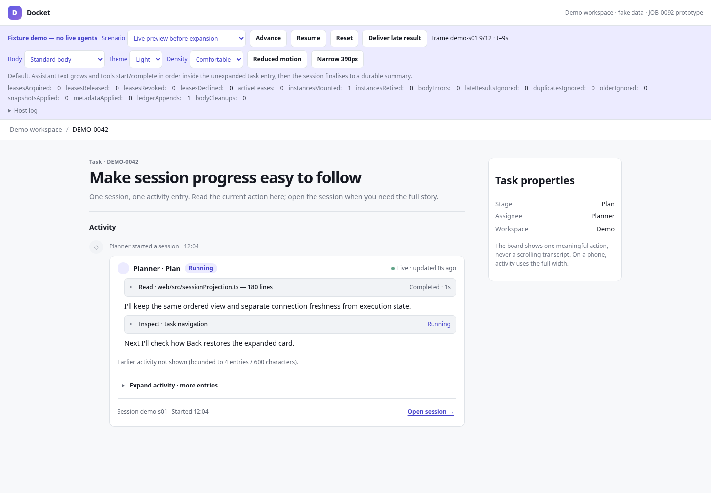
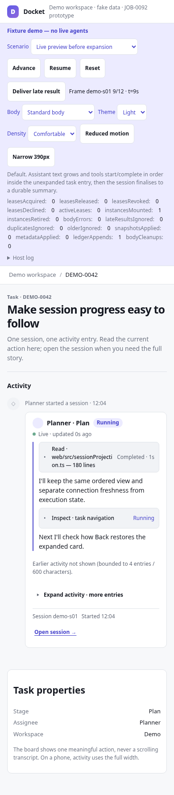
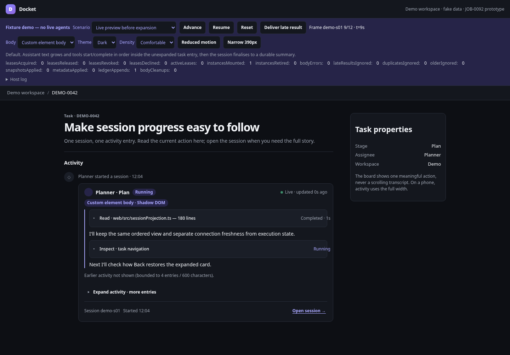
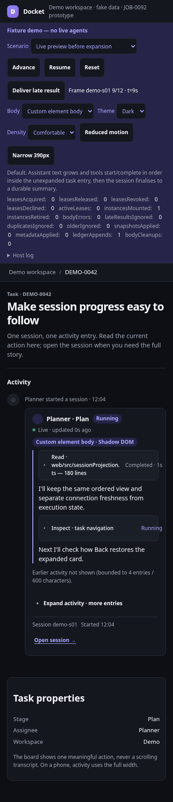
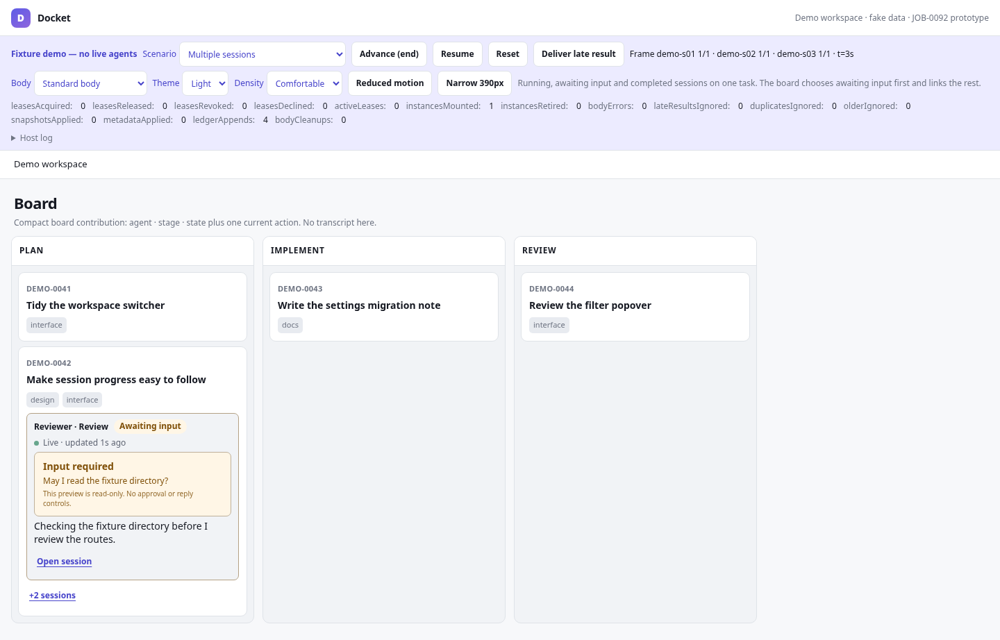
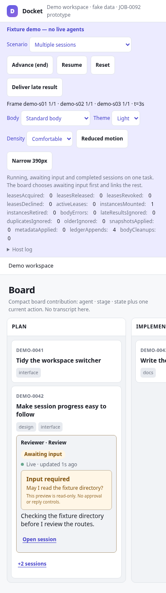
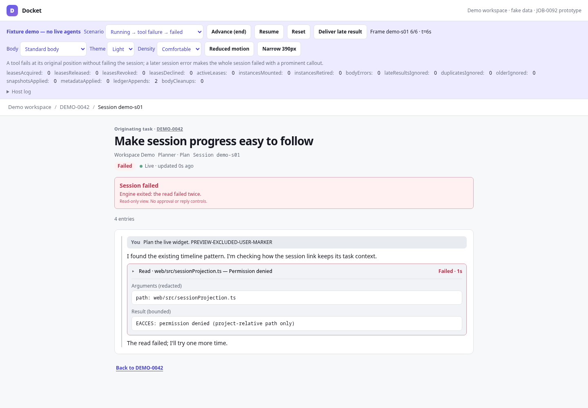
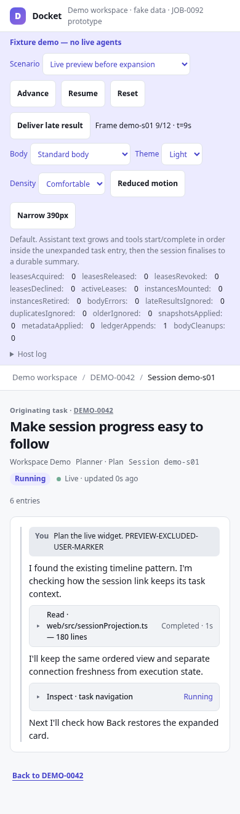

# Live session widgets — design specification and fixture prototype

**Task:** JOB-0092 (PROJ-0002, parent JOB-0091)
**Approved plan:** [v2 — themed widget architecture](https://plans.myslop.app/p/290ec4d511) (approved by Tom Davies, 10 September 2026)
**Owner architecture decision:** JOB-0091 attachment `widget-architecture-decision-2026-09-10.md` (Docket-owned host + shared themed kit + custom Web Component body)
**Docket base:** `30ec1b1c3503843933f97462ee5dd327547545ed`
**Dispatch prior art:** `5bf8aa95eb7b0da03a32c2b8ed001b4ce0d09df4` (`web/src/sessionProjection.ts`, `components/SessionView.tsx`, `hooks/useFollowAtEnd.ts`)

This directory is **design documentation and a fixture-only prototype**. It changes no production Docket or Dispatch code, no plugin manifest, and not `docs/plugin-ui.d.ts`. It is not an SDK, loader, kit package or second session projection.

| File | What it is |
| --- | --- |
| [`interaction-spec.md`](interaction-spec.md) | The reviewed interaction specification: hierarchy, anatomy, tokens, states, navigation, keyboard, streaming, finalisation, data minimisation, prior art. |
| [`contracts.proposed.ts`](contracts.proposed.ts) | **Proposed** context/snapshot/publisher/detail types. Illustrative names; JOB-0093 owns the production API. Type-checked with the prototype so examples cannot drift. |
| [`requirements-to-fixtures.md`](requirements-to-fixtures.md) | Every acceptance requirement mapped to a named fixture, an automated check and the downstream owner. |
| [`prototype/`](prototype/) | Isolated Bun-served demo: illustrative wrapper, kit roles, standard body and `<demo-session-body>` custom element, fixture host, deterministic scenarios. |
| [`tests/`](tests/) | `publisher.test.ts` (bounds/filtering), `contrast.test.ts` (token contrast), `browser.test.ts` (158 headless checks), `screenshots.ts`. |
| [`screenshots/`](screenshots/) | Evidence captured from pinned fixture frames at 1440px and 390px, light and dark. |

## Ownership split (unchanged by this task)

- **JOB-0092 (this):** design docs, proposed contracts, fixture prototype, evidence.
- **JOB-0093:** production host, versioned context/snapshot/lifecycle API, compatibility adapter from `update(task)`, shared themed kit, custom-element adapter, registration/version/reload rules, runtime budgets.
- **JOB-0050:** the real Dispatch session widget and publisher, reusing Dispatch's tested projection across the plugin boundary.
- **JOB-0095:** authoring SDK exposing the delivered kit/adapter/types.
- **Cockpit:** links the approved plan and this prototype from JOB-0050 and JOB-0093 before their production work starts. That receipt is a coordinator acceptance item, not claimed here.

Not in scope and deliberately absent: steer, stop, reply, wait resolution, permission or plan-approval controls; remote loading; any live wiring; Shadow DOM as a security boundary.

## Preview

Requirements: Bun 1.3.x. No other install is needed to run the demo.

```sh
bun docs/design/live-sessions/prototype/serve.ts
# JOB-0092 fixture demo: http://127.0.0.1:<port>/workspaces/demo
```

Set `PORT=4173` for a fixed port. The server is loopback-only, serves allowlisted static files and demo routes, returns 405 for any non-GET/HEAD method and 404 for `/api*` or `*/stream`. The page carries `connect-src 'none'`, so nothing in the browser can fetch, open a WebSocket or EventSource, or submit a form. It never reads `DOCKET_HOME`, registry state or live task/session stores.

Demo routes:

- `/workspaces/demo` — board with compact contributions
- `/workspaces/demo/tasks/DEMO-0042` — task activity with one stable entry per session
- `/plugins/dispatch/sessions/demo-s01` — full session with originating-task context
- anything else — honest not-found page

One-shot query parameters (stripped after load so refresh keeps state): `scenario=<id>`, `frame=<n>`, `paused=1`, `body=standard|custom-element`, `theme=light|dark`, `density=compact|comfortable`, `motion=reduced`, `narrow=1`. Scenario IDs are listed in the strip's selector and in `prototype/fixtures.ts`.

## Human test script (about ten minutes)

1. Start the server and open `/workspaces/demo`. The strip says **Fixture demo — no live agents**. Click **DEMO-0042**.
2. Without clicking anything in the card, watch for ~10 s: assistant text grows, `Read · web/src/sessionProjection.ts` appears, changes to *Reading 180 lines*, then *Completed · 1s* — in the same row — then more text and a second tool. The URL stays on the task; **Expand activity** stays closed; `activeLeases` in the strip stays 0.
3. Click **Pause**. Switch **Body** to *Custom element body*: the header, notices, footer and Open session link are unchanged; the body shows a *Custom element body · Shadow DOM* badge with the same ordered rows. Switch **Theme** to *Dark*, **Density** to *Compact*, toggle **Reduced motion** (the live dot stops pulsing). Note `instancesMounted` does not change for theme/density/motion.
4. Click **Narrow 390px**. Text wraps, nothing clips, the Open session link is reachable. Turn it off.
5. Click **Resume**. Select some assistant text with the mouse: new frames no longer move the preview; a **New activity · show** button appears while the status badge and freshness keep updating. Switch to *Awaiting input → running* with text still selected and click **Advance**: the **Input required** callout appears above the held preview, and clears two frames later. Deselect, click **New activity · show**, and the preview advances.
6. Press **Tab** to reach **Expand activity**, press **Enter**. Tool rows become disclosures; Space opens one and shows redacted arguments and a bounded result. `activeLeases` is now 1. Click **Advance**: the rows do not move; **New activity · show** applies them when you choose. Tab to the *open transcript* link inside the body, Advance again: focus stays on it. Collapse the card: focus returns to the toggle and `activeLeases` is 0.
7. Tab to **Open session →**; click **Advance** and focus stays on the link. Press Enter. The session page shows *Originating task · DEMO-0042*, the title and an ordered transcript (the user prompt appears here only). Press **F5**: same page. Press browser **Back**: the task page returns with the card expanded, focus on the Open session link and the same scroll position.
8. Select some preview text, then Advance to the end of the live scenario. The body stays visible with your selection intact; the badge says *Completed* and a **Session finished · show summary** button appears. Deselect and click it: the card collapses to a durable summary with *Summary saved · No approval implied*, known duration and the plan link. Click **Expand completed activity** to reopen it. (Without a selection, completion collapses on its own.)
9. Use the **Scenario** selector for: *Pending → running*, *Awaiting input → running*, *Running → tool failure → failed*, *Running → cancelled*, *Disconnected → stale → rehydrated*, *Missing service*, *Plugin removed*, *Unknown data version*, *Duplicate and older snapshots*, *Detail gap and reset*, *Body error*, *Context and snapshot updates*. Use **Advance** to step. Watch the callouts, the freshness label (separate from the execution badge), the fallback record and the strip counters (`bodyErrors`, `instancesRetired`, `lateResultsIgnored`, `duplicatesIgnored`, `olderIgnored`, `leasesRevoked`, `leasesDeclined`, `metadataApplied`, `ledgerAppends` — the last only ever counts creation and finalisation).
   - *Multiple sessions*: expand all three cards. Only the last stays expanded (`activeLeases` 1, `leasesRevoked` 2); the others collapse with a one-line note.
   - *Unknown data version* and *Missing service*: expand first, then Advance. The detail closes, `activeLeases` returns to 0, the saved summary stays, and (missing service) **Expand** is disabled until the service returns.
   - *Duplicate and older snapshots*: Advance twice (5, 5, 3), then switch **Body**. The tool row is still there: the remount used the accepted revision 5, not the rejected revision 3.
   - *Context and snapshot updates*: the first Advance renames the page heading without remounting; after the identity switch, click **Deliver late result**: `lateResultsIgnored` increments and nothing on the page changes.
10. *Long session and long output*: open the session page. It shows *entries 7–206 of 206 (200 at a time)*. **Show earlier** reaches *Entry 1* and offers **Show later**; Advance while pinned and the window does not move. Open the *Run · bounded output* tool: 2,000 characters and **Show more · 3,000 characters remaining**; two clicks reveal the rest and *End of result*.
11. Open the browser network panel: only `app.js`, CSS and demo HTML routes. Open `/plugins/dispatch/sessions/does-not-exist`: a not-found page with a workspace link and no guessed task.

## Automated checks

From `docs/design/live-sessions/`:

```sh
bun install                 # playwright + typescript, local to this directory only
bun run typecheck           # contracts.proposed.ts + prototype + tests
bun run test                # publisher bounds/filtering + token contrast
CHROMIUM_PATH=/usr/bin/chromium bun run check:browser   # 158 headless checks
CHROMIUM_PATH=/usr/bin/chromium bun run screenshots     # regenerates screenshots/
```

`check:browser` intercepts every request and fails on any off-origin URL, `/api` path, WebSocket/EventSource or non-GET method. Each check is labelled with the `requirements-to-fixtures.md` identifier it proves.

Root application dependencies, committed production builds and `web/` are untouched; `node_modules/` here is ignored by the repository `.gitignore`.

## Manual accessibility check (not claimed by automation)

Screen-reader usability was checked manually with the accessibility tree only, not with a live screen reader:

- Each card is an `article` labelled by its plugin label; execution status and freshness are text, not colour alone.
- A single polite live region per card announces one sentence on an attention transition (input/error) and on finalisation; streamed text is not announced token by token.
- Disclosures are native buttons with `aria-expanded`/`aria-controls`; tool rows in detail mode carry a label with tool name and status.
- Error notices use `role="alert"`, input requests and availability notices use `role="status"`.
- A full screen-reader pass (NVDA/VoiceOver) remains a JOB-0093 conformance item.

## Screenshots

Captured by `tests/screenshots.ts` from pinned frames. Static v1 planning mockups (task attachments `job-0092-mockups-v1.html`, `job-0092-desktop-v1.png`, `job-0092-phone-v1.png`) remain visual references only; the files here are runtime evidence.

| Desktop 1440px | Phone 390px |
| --- | --- |
|  |  |
|  |  |
|  |  |
|  |  |

More: `task-expanded-desktop`, `task-held-completed-desktop` (selected preview through finalisation with the explicit summary control), `task-multi-session-*`, `task-multi-session-reselected-desktop` (one detail selection per view), `session-long-window-desktop` (pinned earlier window and Show more), `state-stale`, `state-cancelled`, `state-missing-service`, `state-plugin-removed`, `state-unknown-version`, `state-body-error`, `not-found`.
